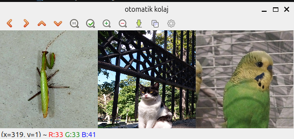

# 🖼️ Otomatik Görüntü Kolajı Oluşturucu

Bu proje, veriye dayalı görüntü işleme mantığını anlamak için geliştirilmiştir. Bir CSV dosyasındaki (Excel benzeri tablo) koordinat verilerini okuyarak, birden fazla görselden belirli parçaları keser ve bunları otomatik olarak yan yana birleştirerek bir kolaj oluşturur.

---

## 🚀 Özellikler

* **Pandas ile Veri Yönetimi:** Görsel meta verileri (dosya yolu, kırpma koordinatları) bir `.csv` dosyasından dinamik olarak okunur.
* **NumPy ile Görüntü Manipülasyonu:** Görüntüler matematiksel matrisler olarak ele alınır; dilimleme (slicing) yöntemiyle kırpılır ve `hstack` ile birleştirilir.
* **Otomatik Boyutlandırma:** Farklı boyutlardaki kırpılmış görseller, kolajın bozulmaması için `cv2.resize` ile standart bir boyuta getirilir.

---

## 📂 Dosya Yapısı ve CSV Formatı

Programın çalışması için CSV dosyasının şu başlıkları içermesi gerekir:
`resim_yolu, x1, y1, x2, y2`

* `resim_yolu`: İşlenecek görselin adı.
* `x1, y1`: Kırpma alanının sol üst köşesi.
* `x2, y2`: Kırpma alanının sağ alt köşesi.

---

## 🎨 Örnek Kolaj Çıktısı

Programın çalıştırılması sonucunda elde edilen kolaj görüntüsü aşağıdadır:

