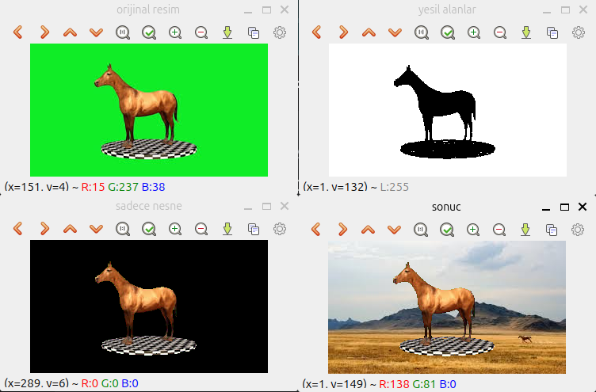

# 🎬 Yeşil Ekran Uygulaması

Bu proje, Yeşil Ekran teknolojisinin arkasındaki temel görüntü işleme mantığını uygulamalı olarak gösterir. Projede, yeşil arka plana sahip bir görseldeki pikseller maskelenerek temizlenir ve yerine dinamik olarak yeni bir manzara resmi yerleştirilir.

---

## 🚀 Özellikler

* **HSV Renk Uzayı Dönüşümü:** Işık değişimlerinden etkilenmeden yeşil rengi hassas bir şekilde tespit edebilmek için görüntüler BGR'den HSV formatına dönüştürülmüştür.
* **Hassas Maskeleme (`cv2.inRange`):** Belirli renk limitleri arasındaki (yeşil tonları) pikseller tespit edilerek siyah-beyaz bir maske oluşturulmuştur.
* **Mantıksal Bit Düzeyi İşlemleri (Bitwise):** `bitwise_and` ve `bitwise_not` kapıları kullanılarak ön plan ve arka plan pikselleri matematiksel olarak birbirine geçirilmiştir.
* **Dinamik Boyutlandırma:** Arka plan resmi, ön plan resmiyle otomatik olarak aynı çözünürlüğe getirilerek piksel uyumsuzlukları önlenmiştir.

---

## 🛠️ Kullanılan Teknolojiler ve Fonksiyonlar

* **Python**
* **NumPy:** Maskeleme limitleri için matris dizileri oluşturmada (`np.array`) kullanıldı.
* **OpenCV:**
  * `cv2.cvtColor()`: Renk uzayı dönüşümü için.
  * `cv2.inRange()`: Belirli bir renk aralığını maskelemek için.
  * `cv2.bitwise_and()` & `cv2.bitwise_not()`: Maskeleri görüntüler üzerine uygulamak için.
  * `cv2.add()`: Maskelenmiş iki görseli matematiksel olarak birleştirmek için.

---

## 📂 Dosya Yapısı

* `yesil_ekran.py`: Ana uygulama kodu.
* `yesil.jpg`: Yeşil arka planlı orijinal görseli.
* `manzara.jpg`: Arkaya yerleştirmek istenilen yeni arka plan görseli.
* `sonuc.jpg`: İşlem tamamlandıktan sonra elde edilen nihai görsel.

---

Programın çalıştırılması sonucunda elde edilen görüntü aşağıdadır:

