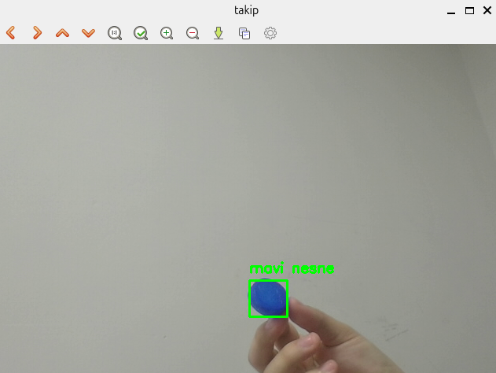

# Renk Tabanlı Nesne Takibi

Bu proje, belirli bir renkteki nesneyi (örneğin mavi bir kapak) kamera görüntüsü üzerinde gerçek zamanlı olarak tespit etme ve hareketini takip etme amacıyla geliştirilmiştir. Görüntü işlemenin temel taşları olan maskeleme, kontur analizi ve geometrik sınırlama teknikleri kullanılmıştır.

---

## Özellikler

* **HSV Renk Uzayı Takibi:** Işık değişimlerinden daha az etkilenen **HSV (Hue, Saturation, Value)** renk uzayı kullanılarak hassas renk filtreleme yapılmıştır.
* **Gürültü Temizleme:** Görüntüdeki küçük parazitleri yok etmek için morfolojik işlemler (Erosion/Dilation mantığı) uygulanabilir yapıdadır.
* **Dinamik Kontur Analizi (`findContours`):** Maskelenen piksellerin dış hatları (Contour) çıkarılarak nesne gruplandırılmıştır.
* **Otomatik Sınırlama (`boundingRect`):** Tespit edilen karmaşık şekilli nesnelerin etrafına dinamik olarak yeşil bir takip karesi yerleştirilmiştir.

---

## Teknik Terimler ve Sözlük

* **HSV (Hue, Saturation, Value):** Renk Özü, Doygunluk ve Parlaklık. Takip için en ideal renk formatıdır.
* **Contour (Kontur):** Nesnenin dış hatlarını belirleyen koordinat dizisi.
* **Bounding Box (Sınırlayıcı Kutu):** Nesneyi içine alan en küçük dikdörtgen.
* **ROI (Region of Interest):** İlgi alanı; yani resmin tamamı değil, sadece nesnenin olduğu bölge.
* **FPS (Frames Per Second):** Saniye başına işlenen kare sayısı (Takip akıcılığı).

---

## Kullanılan Fonksiyonlar

* `cv2.inRange()`: Belirlenen mavi renk aralığını maskelemek için.
* `cv2.findContours()`: Beyaz piksellerin sınır hatlarını bulmak için (**RETR_TREE** hiyerarşisiyle).
* `cv2.contourArea()`: Küçük gürültüleri elemek (alan filtresi) için.
* `cv2.boundingRect()`: Konturu `x, y, w, h` koordinatlarına dönüştürmek için.
* `cv2.rectangle()`: Nesnenin etrafına görsel çerçeve çizmek için.

---

Programın çalıştırılması sonucunda elde edilen görüntü aşağıdadır:

